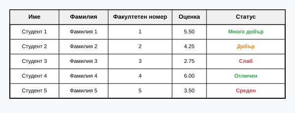
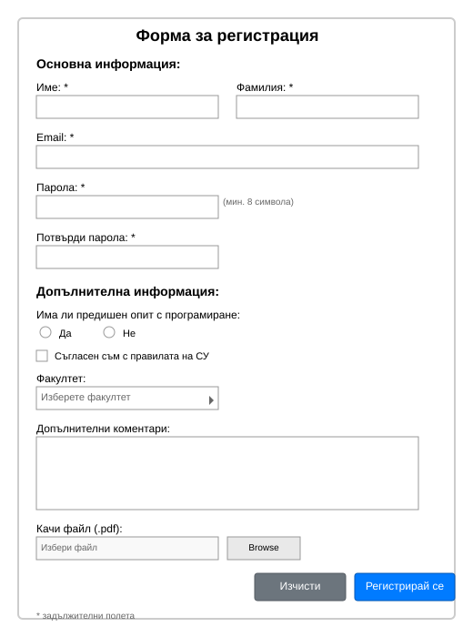

# HTML Упражнения - Основи на HTML
---

## Задача 1: Основна HTML структура и форматиране на текст

Създайте HTML страница с име `task1.html`, която съдържа:

- Заглавие на страницата: "Моята първа HTML страница"
- Заглавие от първо ниво (h1): "Добре дошли в света на HTML"
- Параграф с **удебелен текст** и *курсив текст*
- Неподреден списък с 3 елемента за вашите хобита
- Подреден списък с 5 стъпки как да се прави палачинка
- Хоризонтална линия (`Horizontal Rule/Thematic Break`)
- Параграф с връзка към уебсайта на ФМИ: https://www.fmi.uni-sofia.bg/

---

## Задача 2: Работа с изображения и връзки

Създайте HTML страница с име `task2.html`, която съдържа:

- Заглавие: "Галерия с изображения"
- 3 изображения (можете да използвате placeholder изображения от https://picsum.photos/)
  - Първото изображение да има размери 300x200 пиксела
  - Второто изображение да има alt текст по ваш избор
  - Третото изображение да е връзка към друга страница
- Навигационно меню с връзки към:
  - task1.html (да се отваря в същия прозорец)
  - https://www.google.com (да се отваря в нов прозорец)
  - mailto:student@fmi.bg (email връзка)

---

## Задача 3: HTML таблица

Разгледайте следното изображение и създайте HTML таблица, която да изглежда точно така:

Създайте файл `task3.html` с:
- Заглавие: "Резултати от изпит"
- HTML таблица със следните характеристики:
  - Заглавна редица с колони: "Име", "Фамилия", "Факултетен номер", "Оценка", "Статус"
  - 5 реда с данни за студенти
  - Използвайте подходящи HTML елементи за заглавни клетки

**Данни за таблицата:**
- Студент 1, Фамилия 1, 1, 5.50, Много добър
- Студент 2, Фамилия 2, 2, 4.25, Добър
- Студент 3, Фамилия 3, 3, 2.75, Слаб
- Студент 4, Фамилия 4, 4, 6.00, Отличен
- Студент 5, Фамилия 5, 5, 3.50, Среден

**Забележка:** За да получите цветове като в изображението, използвайте приложения CSS файл `table-styles.css` и добавете подходящи `class` атрибути към клетките със статус:
- За "Слаб" и "Среден" използвайте `class="poor"`
- За "Добър" използвайте `class="good"`
- За "Много добър" и "Отличен" използвайте `class="excellent"`

---

## Задача 4: HTML форма

Разгледайте следното изображение и създайте HTML форма за регистрация, която да изглежда така:

Създайте HTML страница с име `task4.html` с форма за регистрация, която съдържа:

**Основна информация:**
- Текстово поле за име (задължително)
- Текстово поле за фамилия (задължително)
- Email поле (задължително)
- Поле за парола
- Поле за потвърждение на парола

**Допълнителна информация:**
- Checkbox за университет: "Съгласен съм с правилата на СУ"
- Dropdown меню за факултет с опции: ФМИ, БФ, ЮФ, МФ, ФФ
- Textarea за допълнителни коментари (5 реда, 40 колони)
- Поле за качване на файл (приемайте само .pdf файлове)

**Бутони:**
- Submit бутон с текст "Регистрирай се"
- Reset бутон с текст "Изчисти формата"

**Изисквания:**
- Всички задължителни полета да са маркирани семантично, не само визуално
- Използвайте подходящите input типове (email, password, file и т.н.)
- Групирайте свързаните полета с `<fieldset>` и `<legend>`
- Всяко поле да има подходящ `<label>`

**Забележка:** За подобен външен вид като в изображението можете да използвате приложения CSS файл `form-styles.css`. За правилно оформление използвайте следните CSS класове:
- За групиране на радио бутоните: `class="radio-group"`
- За контейнера на бутоните: `class="button-container"`
- За бележката за задължителни полета: `class="required-note"`

---

## Допълнителни ресурси

- [MDN HTML Guide](https://developer.mozilla.org/en-US/docs/Web/HTML)
- [HTML5 Semantic Elements](https://www.w3schools.com/html/html5_semantic_elements.asp)
- [HTML Forms Guide](https://developer.mozilla.org/en-US/docs/Web/Guide/HTML/Forms)

